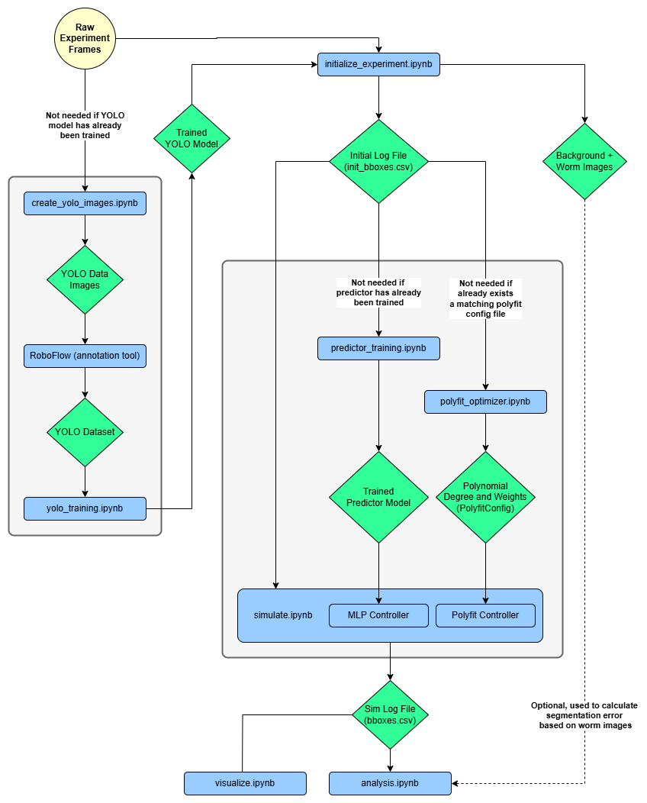

# General workflows

Here we will go over the steps to do some of the main tasks, from training a YOLO model on custom data to running simulations with different
configurations. All of the main Workflows have a dedicated, interactive notebook (.ipynb file) ready to use with explanations for each step. All
of the workflow notebooks are located in a dedicated folder called "workflows".

## Workflow Files Descriptions

`create_yolo_images.ipynb` - Prepares raw frames of some experiment for the process of training YOLO model on them. This step entails
detecting the worm in selected frames and cropping a region of pre-defined size around the worms.

`yolo_training.ipynb` - Used to train a YOLO model on a given dataset. The training dataset was prepared by annotating 3 the images which
were extracted using the notebook create_yolo_images. The annotation process can be done with RoboFlow, which is an online dataset
creation and annotation tool.

`initialize_experiment.ipynb` - In order to run system simulations on a new experiment, first it’s essential to initialize the experiment. The
initialization step runs the YOLO predictor on the raw experiment, detects worm’s head position in each frame and saves the detection results
into a log. That log would be later used for simulating different control algorithms on the experiment. In addition, the background image and
worm images are extracted from the raw frames. These can be used later during analysis, to calculate the segmentation based error. This log is
useful since in the future the simulator can simply read worm head positions from the log, instead of using YOLO to predict worm’s head
position in every frame of interest (which is much slower, especially on computers without a dedicated graphics card).

`simulate.ipynb` - Run a full system simulation on some previously initialized experiment. The simulation is ran by reading an experiment
log produced by the initialization process - in each frame, worm’s head position is retrieved from the log. In this notebook it is possible to
simulate the system with any controller and any configuration parameters, not only the ones of used for the initial experiment log. Similar to
the initialization process, the simulation produces a log, which would be later used to analyze system’s performance and its behavior.

`analysis.ipynb` - This notebook is used to analyze the performance of a control algorithm (controller). A log which was produced by running
simulate is read and analyzed, and different plots and statistics are presented. In addition, there is an option to calculate segmentation
evaluation-error, by counting how many pixels of the worm are outside of the microscope view. To this end, we use the background and worm
images which were extracted during the run of intialize_experiment notebook for this experiment.

`visualize.ipynb` - Given a system log which was produced by simulate, this notebook is able to visually recreate the simulator’s behavior. At
each frame, the position of worm’s head is drawn, the position of the microscope FOV, and also the camera FOV. This notebook is used to
visually assess the performance and the behavior of the simulator, and to visually investigate what causes the system to misbehave.
predictor_training - Used to train a specific simulation control algorithm. The MLPController *is an algorithm that uses a neural
network (NN) to predict worm’s future position. Since this algorithm is NN based, it requires training. That script is responsible to train that
NN from experiment log files, which were produced by either running initialize or simulate (doesn’t matter).

`polyfit_optimizer.ipynb` - This notebook is used to tune the parameters of a specific simulation control algorithm. The PolyfitController
is an algorithm that uses polynomial-fitting to predict worm’s future position. A polynomial is fitted from past observations at previous time
stamps, and afterwards sampled in the future time to predict worm’s position. This notebook is used to determine the optimal degree of the
fitted polynomial, and to find the optimal weight of each past sample for the fitting process.

## Workflow Files Dependency Graph

    
    <em>
    Workflow outline and the dependencies between each notebook files. Blue color (rectangles) denotes an interactive notebook file, green color (diamond) denotes intermediate outputs between different files, and the global input is in yellow color (circle). 
Dotted line denote optional dependencies.</em>

## Complete Workflows    

### Conducting an Experiment

Here we explain how to properly capture the footage of an experiment for the simulator.

1. Decide on the frame rate (FPS) of the experiment. There are two distinct scenarios:

    1.  If the sole reason for the experiment footage is to be used for YOLO training, a very low FPS can be used (can be as low as 1 FPS or even lower if possible).
    Ideally, a single frame would be captured every few seconds.
    
    2. If a simulation to be run on the experiment footage, a high FPS should be used, preferably at least 60 FPS.
    
    Note, that the the chosen frame rate should be the same frame rate on which the platform control algorithms were calibrated.
    
2. The camera should be completely stationary from which the entire arena is visible.

3. The footage should be captured as distinct images for each frame, not as a continious video. We recommend to use *"bmp"* image format, which is lossless, and is able to save single channel if the image is grayscale.

4. Make sure that the distinct frames are saved as images with the frame number appearing in their name, such that it's possible to read them in-order.

5. If you want to run a system simulation on the experiment, follow the steps in the `initialize_experiment` notebook. 

### YOLO Model Training

Below is the workflow to train a YOLO model to detect worm's head position:

1. Conduct a new experiment and capture the footage, as explained in the previous section.

2.  Determine the image size for the YOLO model, this size should match the desired input image size during a simulation run.

    1. At the time of writing, it is possible to pass images of different sizes to YOLO models, but they are scaled to the closes multiple of 32. This means you should use and train YOLO models on images with sizes that are a multiple of 32 when possible.
    
    2. A YOLO model should be trained on images with the same size, it is not expected to work well on images of different sizes without special attention.

    3.  Be careful of a Distribution Shift, this means that the training data is different (not representative) of the real world. For example: 

        1. In the training data, are the worms always in a similar position?

        2. Is the background lighting consistent with the one on the system?

        3. Is the size of each pixel the same as in the system?
        
        4.Are the worms in the dataset representative of the worm population?
    
3. Create a set of images for annotation - Follow the instructions in the `create_yolo_images` python notebook. Make sure to provide the correct image size, which was determined in the previous step.

4. Annotate the data - The annotation process is the process of marking the actual worm head position in the extracted images. To do so, we recommend using the website [RoboFlow](https://roboflow.com/), which provides easy-to-use tools to annotate the data, and create a dataset for YOLO models.

5. Create a YOLO dataset - If you used Roboflow to create the dataset - on the dataset page you can click on 'export dataset' and then 'show download code'. You can copy the code snippet to the appropriate place in the notebook of step 6 to download the dataset to the computer and use it for training.

6. Follow the instructions in the `yolo_training` notebook and train the YOLO model.
    

There are two approaches to tackle the challenges of distribution shift, mentioned earlier. The first approach is to carefully train the YOLO model on very similar conditions as of the final system. The resulting model will function well, but if conditions change then models performance will likely degrade.   

The other approach is to train the model on wide variety of settings (e.g. different lighting conditions or different magnification levels), leading to a more robust model. The benefit of this approach is that the model is more robust to changes, but a disadvantage is that such models usually require more data, and may perform slightly worse than models carefully trained on some very specific conditions. 

### Perform System Simulation

Below is the workflow of performing a full system simulation on some experiment, and analyzing the results.

1. If the experiment was not initialized yet, make sure to follow the instructions in the `initialize_experiment` notebook. 

2. Decide on the platform control algorithm to be used.

    1. If **`MLPController`** algorithm is chosen: the MLP controller works by a neural network that predicts future positions of the worm. If that network needs training then first run `predictor_training` notebook.
    Note, that the neural network should be trained only once. Once the network is trained, there is no need to perform this step anymore. 
    
    2. If **`PolyfitController`** algorithm is chosen, and the hyper-parameters of the controller should be tuned then first run the `polyfit_optimizer` notebook.
    Note, that the hyper-parameters of this controller should be tuned only once. Once they were tuned, there is no need to perform this step anymore. 

3. Follow the steps in the `simulate` notebook. The result of running this notebook is a log file containing the full simulation log.

4. To visualize the simulation run `visualize` notebook, and to analyze the performance of the control algorithm, and general statistics of the conducted experiment run the `analyze` notebook. Both of these notebooks analyze the log produced by `simulate`.
